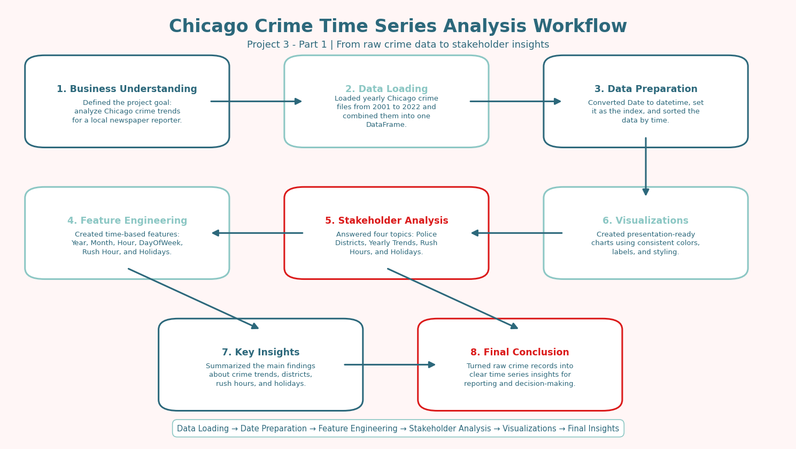

# 🚔 Chicago Crime Time Series Analysis


---

## 📌 Project Overview

This project analyzes reported crime incidents in **Chicago from 2001 to 2022** using **time series analysis** techniques.

The main goal is to answer stakeholder questions for a **local newspaper reporter** and provide clear, visual, and data-supported insights about crime trends across:

* 🗓️ Years
* 🏙️ Police districts
* 🚦 Rush hours
* 🎉 Holidays

Unlike a classical machine learning workflow, this project does **not** focus on building a predictive model.
Instead, it focuses on **exploratory time series analysis, feature engineering, aggregation, and visual storytelling**.

---

## 🎯 Business Understanding

The stakeholder is a local newspaper reporter who wants to better understand crime patterns in Chicago.

This analysis helps answer questions such as:

* Which police districts had the most and least crimes in 2022?
* Is reported crime increasing or decreasing over time?
* Are crimes more common during AM or PM rush hour?
* Which holidays had the highest number of reported crimes?
* What crime types are most common during these time periods?

---

## 🗂️ Dataset

The dataset contains reported crime incidents in Chicago from **2001 to 2022**.

Each row represents **one reported crime incident**.

The dataset includes:

* 🕒 Crime date and time
* 🚨 Primary crime type
* 🏙️ Police district
* 👮 Arrest status
* 🏠 Domestic indicator
* 📍 Latitude and longitude
* 🗺️ Ward and location details

The data was provided as yearly CSV files and combined into one dataset for analysis.

---

## 🔄 Project Workflow

The workflow below summarizes the steps used in this project.

📍 **Image location:** `Project_Workflow.png`



---

## 🧹 Data Preparation

The following steps were applied before analysis:

1. Loaded yearly crime files from **2001 to 2022**.
2. Combined all files into one DataFrame.
3. Converted the `Date` column into datetime format.
4. Set `Datetime` as the time series index.
5. Sorted the data by time.
6. Created time-based features:

   * Year
   * Month
   * Month Name
   * Hour
   * Day of Week
   * Rush Hour Period
   * Holiday Name

A daily resampled version was also created where each row represents one day and the value represents total reported crimes.

---

## 📊 Stakeholder Questions Analyzed

This project analyzes **four main topics**:

| Topic       | Focus                      |
| ----------- | -------------------------- |
| 🏙️ Topic 1 | Comparing Police Districts |
| 📉 Topic 2  | Crimes Across the Years    |
| 🚦 Topic 3  | AM vs PM Rush Hour         |
| 🎉 Topic 4  | Comparing Holidays         |

---

# 🏙️ Topic 1: Comparing Police Districts

## ❓ Question

Which police district had the most crimes in 2022?
Which district had the least?

## ✅ Result

In **2022**, **District 8** had the highest number of reported crimes with **14,805 crimes**.

**District 31** had the lowest number of reported crimes with only **15 crimes**.

📍 **Image location:** `Comparing_Polic_Districts.png`


## 💡 Insight

Crime distribution was not equal across Chicago police districts.
Some districts had much higher crime counts than others, which may be related to population size, area activity, reporting patterns, or district boundaries.

---

# 📉 Topic 2: Crimes Across the Years

## ❓ Question

Is the total number of crimes increasing or decreasing across the years?
Are there any individual crimes moving in the opposite direction?

## ✅ Result

Total reported crimes in Chicago decreased from **485,886 crimes in 2001** to **238,858 crimes in 2022**.

This represents a decrease of **247,028 crimes**, or about **50.84%**.

📍 **Image location:** `Crimes_Across_the_Years.png`


Although overall crime decreased, some crime types increased over the same period.

The largest increases included:

* 🚨 Weapons Violation
* 🚨 Criminal Sexual Assault
* 🚨 Deceptive Practice
* 🚨 Stalking
* 🚨 Homicide

📍 **Image location:** `Opposite_Crime_Trends.png`


## 💡 Insight

The overall crime trend decreased significantly, but not every crime category followed the same pattern.
Some crime types increased despite the overall decline, which highlights the importance of analyzing both total crime and individual crime categories.

---

# 🚦 Topic 3: AM vs PM Rush Hour

## ❓ Question

Are crimes more common during AM rush hour or PM rush hour?

For this project:

* 🌅 **AM Rush Hour:** 7:00 AM to before 10:00 AM
* 🌆 **PM Rush Hour:** 4:00 PM to before 7:00 PM

## ✅ Result

Crimes were more common during **PM Rush Hour**.

| Rush Hour Period | Reported Crimes |
| ---------------- | --------------: |
| 🌅 AM Rush Hour  |         770,651 |
| 🌆 PM Rush Hour  |       1,206,353 |

📍 **Image location:** `AM_vs_PM_Rush_Hour.png`


The top 5 crimes during **AM Rush Hour** were:

1. Theft
2. Battery
3. Criminal Damage
4. Burglary
5. Other Offense

The top 5 crimes during **PM Rush Hour** were:

1. Theft
2. Battery
3. Criminal Damage
4. Narcotics
5. Assault

📍 **Image location:** `The_top_5_crimes.png`


Motor Vehicle Theft was also more common during **PM Rush Hour**:

| Period          | Motor Vehicle Theft Cases |
| --------------- | ------------------------: |
| 🌅 AM Rush Hour |                    41,578 |
| 🌆 PM Rush Hour |                    53,716 |

📍 **Image location:** `Motor_Vehicle_Theft.png`


## 💡 Insight

PM rush hour had higher crime activity than AM rush hour.
Theft was the most common crime in both periods, and Motor Vehicle Theft was also higher during PM rush hour.

---

# 🎉 Topic 4: Comparing Holidays

## ❓ Question

What are the top 3 holidays with the largest number of crimes?
For each holiday, what are the top 5 most common crimes?

## ✅ Result

The top 3 holidays with the highest number of reported crimes were:

| Holiday               | Reported Crimes |
| --------------------- | --------------: |
| 🎆 New Year's Day     |          32,725 |
| 🇺🇸 Independence Day |          22,672 |
| 👷 Labor Day          |          22,164 |

📍 **Image location:** `Comparing_Holidays.png`


For **New Year's Day**, the top crimes were:

* Theft
* Battery
* Criminal Damage
* Deceptive Practice
* Offense Involving Children

For **Independence Day**, the top crimes were:

* Battery
* Theft
* Criminal Damage
* Assault
* Narcotics

For **Labor Day**, the top crimes were:

* Battery
* Theft
* Criminal Damage
* Narcotics
* Assault

📍 **Image location:** `Top_Holiday_Crimes.png`


## 💡 Insight

**New Year's Day** had the highest number of reported crimes among holidays.
Theft was the most common crime on New Year's Day, while Battery was the most common crime on Independence Day and Labor Day.

---

## 🔑 Key Findings

* 📉 Reported crime in Chicago decreased by about **50.84%** from 2001 to 2022.
* 🏙️ **District 8** had the highest number of reported crimes in 2022.
* 🚦 Crimes were more common during **PM Rush Hour** than AM Rush Hour.
* 🧾 **Theft** was one of the most common crimes across multiple analyses.
* 🎆 **New Year's Day** had the highest number of reported crimes among holidays.
* ⚠️ Some crime types increased even though the overall crime trend decreased.

---

## 🛠️ Tools and Libraries

* Python
* Pandas
* NumPy
* Matplotlib
* Seaborn
* Holidays
* Google Colab

---

## 📁 Repository Structure

```text
chicago-crime-time-series-analysis/
│
├── README.md
├── Project3_Part1_Chicago_Crime.ipynb
│
├── images/
│   ├── workflow.png
│   ├── police_districts_2022.png
│   ├── crimes_across_years.png
│   ├── opposite_crime_trends.png
│   ├── rush_hour_comparison.png
│   ├── top_rush_hour_crimes.png
│   ├── motor_vehicle_theft_rush_hour.png
│   ├── holiday_crimes.png
│   └── top_holiday_crimes.png
│
└── data/
    └── README.md
```

---

## ▶️ How to Run

1. Clone this repository.
2. Open the notebook in Google Colab or Jupyter Notebook.
3. Mount Google Drive or update the data path.
4. Run the notebook cells in order.

---

## 👩‍💻 Author

**Doha Samir**

Data Science & Machine Learning Learner
Palestine 🇵🇸

---

## ✅ Project Status

Completed as part of **Project 3 - Part 1: Time Series Analysis**.
